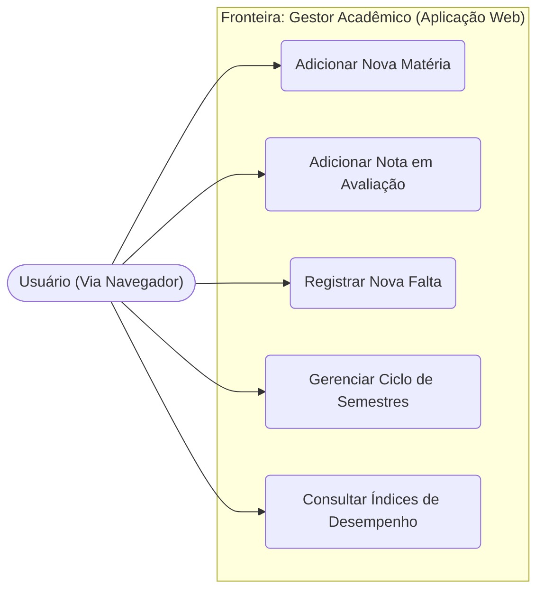
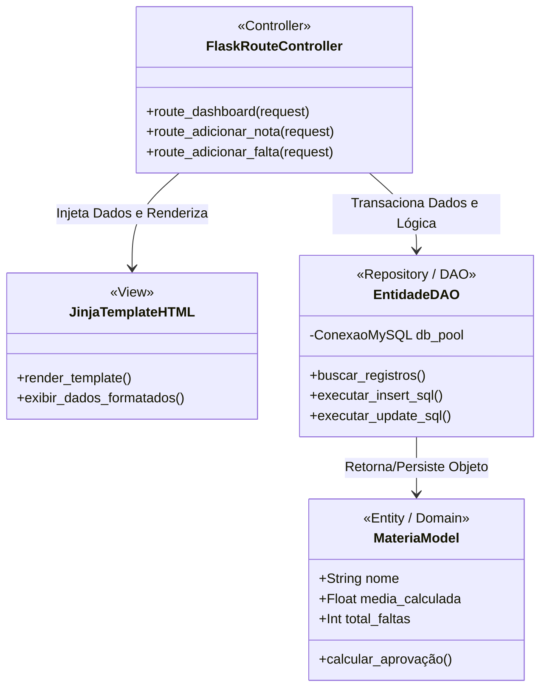
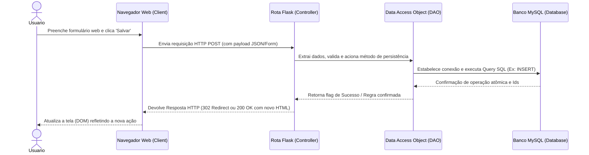

# Documentação de Análise de Sistemas: Modelagem UML da Arquitetura Web

## 1. Visão Geral
Este documento exibe as reestruturações aplicadas na modelagem estrutural e comportamental da aplicação (Diagramas UML) do "Gestor Acadêmico", evidenciando o contraste gerado pela modernização de um sistema Desktop autônomo (Windows/PyQt) para a nova arquitetura baseada em rede, operando sob o ecossistema Web (Flask/MySQL).

## 2. Diagrama de Casos de Uso (Use Cases)
No escopo de produto e requisitos funcionais, as regras de negócio basilares mantêm-se intactas: o fluxo de Adicionar Nota, Computar Faltas e Gerir Semestres não sofre mutação do ponto de vista do domínio. Contudo, a **fronteira do sistema** expande drasticamente. Abandonamos o confinamento de um "Sistema Operacional Local" e passamos a representar a nova barreira de uma "Aplicação Web" global, exigindo que o Ator interaja remotamente por meio de um cliente padronizado.

## 3. Diagrama de Classes
Em termos de estática arquitetural, as classes do projeto passaram por uma cirurgia de *Decoupling* rigorosa:
1. Houve a erradicação imediata das antigas superclasses oriundas do design visual do Qt Desktop (heranças de `QMainWindow`, `QDialog`, `QWidget`).
2. Adotou-se fisicamente a tríade MVC: O diagrama reflete a inserção explícita dos **Controladores** (as funções de Rota dinâmicas providas pelo Flask), e a representação passiva e delegada das **Views** através de templates HTML formatados via Jinja2. O back-end foca agora unicamente em orquestrar entidades (Model) e persistência (DAO).

## 4. Diagrama de Sequência
O comportamento do sistema e o eixo temporal de vida das transações deixaram de ser baseados em reações elétricas locais.
No ecossistema Desktop, o fluxo era guiado por *"Clique no UI -> Evento de SO -> Processamento Thread Local"*. Agora, adotamos estritamente o ciclo de vida stateless da Web. O fluxo comportamental muda para: *"Usuário submete formulário de dados -> Navegador encapsula requisição HTTP POST -> Servidor de Rotas Flask processa -> Camada DAO salva/altera no MySQL -> Servidor finaliza com resposta HTTP contendo HTML/JSON atualizado"*.

